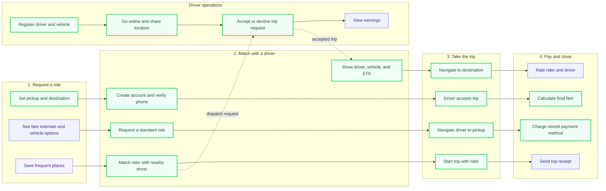

```mermaid
flowchart LR
  subgraph R1["1. Request a ride"]
    direction TB
    R1a["Set pickup and destination"]
    R1b["See fare estimate and vehicle options"]
    R1c["Save frequent places"]
  end

  subgraph R2["2. Match with a driver"]
    direction TB
    R2a["Create account and verify phone"]
    R2b["Request a standard ride"]
    R2c["Match rider with nearby driver"]
    R2d["Show driver, vehicle, and ETA"]
  end

  subgraph R3["3. Take the trip"]
    direction TB
    R3a["Driver accepts trip"]
    R3b["Navigate driver to pickup"]
    R3c["Start trip with rider"]
    R3d["Navigate to destination"]
  end

  subgraph R4["4. Pay and close"]
    direction TB
    R4a["Calculate final fare"]
    R4b["Charge stored payment method"]
    R4c["Send trip receipt"]
    R4d["Rate rider and driver"]
  end

  subgraph D["Driver operations"]
    direction TB
    D1["Register driver and vehicle"]
    D2["Go online and share location"]
    D3["Accept or decline trip request"]
    D4["View earnings"]
  end

  R1a --> R2a --> R3a --> R4a
  R1b --> R2b --> R3b --> R4b
  R1c --> R2c --> R3c --> R4c
  R2d --> R3d --> R4d
  D1 --> D2 --> D3 --> D4
  R2c -. "dispatch request" .-> D3
  D3 -. "accepted trip" .-> R2d

  classDef mvp fill:#f0fdf4,stroke:#4ade80,stroke-width:3px,color:#14532d;
  classDef core fill:#eef2ff,stroke:#818cf8,stroke-width:1.5px,color:#312e81;
  classDef later fill:#f5f3ff,stroke:#a78bfa,stroke-width:1.5px,color:#4c1d95;

  class R1a,R2a,R2b,R2c,R2d,R3a,R3b,R3c,R3d,R4a,R4b,D1,D2,D3 mvp;
  class R1b,R4c,R4d,D4 core;
  class R1c later;

```
